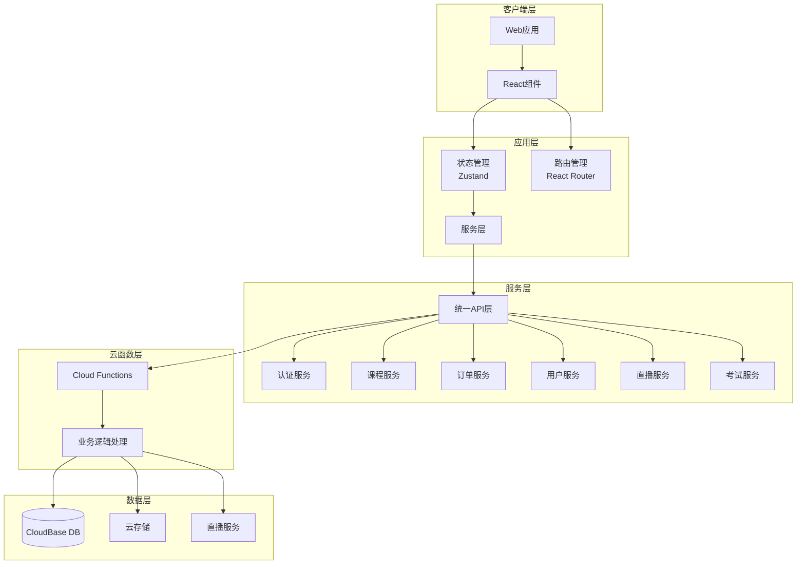

## 项目概述

**无人机培训管理系统 V2.0** - 完全重新开发的线上线下培训综合平台。

### 核心功能模块（12个）

**客户端（5个）**

1. **课程系统** - 课程展示、详情、购买
2. **我的学习** - 已购课程、学习进度、视频播放
3. **在线考试** - 题库练习、模拟考试、成绩记录（新增）
4. **证书管理** - 证书申请、查询、下载（新增）
5. **调课申请** - 学员端调课提交

**管理后台（7个）**

1. **教师管理** - 档案管理、资质认证、排课表
2. **学员管理** - 档案管理、报名记录、出勤统计
3. **课程管理** - 课程发布、章节管理、价格设置
4. **排课管理** - 排课日历、场地管理、教师分配
5. **出勤管理** - 考勤记录、统计报表、导出功能
6. **调课审批** - 申请审批、调课历史
7. **财务统计** - 订单管理、收入统计、教师业绩
8. **营销工具** - 优惠券、拼团活动（新增）

### 系统特性

**用户体验**

- 现代化UI设计，响应式布局
- 流畅的页面过渡动画
- 完善的加载和错误状态处理
- 统一的设计语言

**技术特点**

- 严格的TypeScript类型系统
- 统一的数据访问层
- 组件化开发，高复用率
- 完善的状态管理

## 技术栈

- **前端框架**: React 18 + TypeScript 5.x
- **构建工具**: Vite 5.x
- **UI组件库**: MUI (Material-UI) 5.x + Tailwind CSS
- **状态管理**: Zustand
- **路由**: React Router v6
- **后端服务**: CloudBase (腾讯云)
- **数据库**: CloudBase NoSQL 文档数据库
- **云函数**: Node.js + @cloudbase/node-sdk

## 架构设计

### 系统架构图



### 目录结构

```
drone-training-v2/
├── src/
│   ├── api/                    # 统一API层
│   │   ├── index.ts           # API统一导出
│   │   ├── client.ts          # 客户端SDK封装
│   │   ├── cloudfunctions.ts  # 云函数调用
│   │   └── types.ts           # API类型定义
│   │
│   ├── components/            # 组件库
│   │   ├── common/           # 通用组件
│   │   │   ├── Loading.tsx
│   │   │   ├── ErrorState.tsx
│   │   │   ├── EmptyState.tsx
│   │   │   └── ConfirmDialog.tsx
│   │   ├── layout/           # 布局组件
│   │   │   ├── MainLayout.tsx
│   │   │   ├── AdminLayout.tsx
│   │   │   └── Sidebar.tsx
│   │   └── business/         # 业务组件
│   │       ├── CourseCard.tsx
│   │       ├── CourseGrid.tsx
│   │       ├── StatsCard.tsx
│   │       └── DataTable.tsx
│   │
│   ├── pages/                # 页面组件
│   │   ├── client/          # 客户端页面
│   │   │   ├── Home.tsx
│   │   │   ├── Courses.tsx
│   │   │   ├── CourseDetail.tsx
│   │   │   ├── MyLearning.tsx
│   │   │   ├── Exam/
│   │   │   ├── Certificate/
│   │   │   └── Profile.tsx
│   │   └── admin/           # 管理后台页面
│   │       ├── Dashboard.tsx
│   │       ├── Teacher/
│   │       ├── Student/
│   │       ├── Course/
│   │       ├── Schedule/
│   │       ├── Attendance/
│   │       ├── Finance/
│   │       └── Marketing/
│   │
│   ├── hooks/               # 自定义Hooks
│   │   ├── useAuth.ts
│   │   ├── useCourses.ts
│   │   ├── useOrders.ts
│   │   └── useQuery.ts
│   │
│   ├── store/               # 状态管理
│   │   ├── authStore.ts
│   │   ├── cartStore.ts
│   │   ├── courseStore.ts
│   │   └── index.ts
│   │
│   ├── services/            # 业务服务
│   │   ├── authService.ts
│   │   ├── courseService.ts
│   │   ├── orderService.ts
│   │   ├── userService.ts
│   │   ├── examService.ts
│   │   └── liveService.ts
│   │
│   ├── types/               # 类型定义
│   │   ├── index.ts
│   │   ├── user.ts
│   │   ├── course.ts
│   │   ├── order.ts
│   │   ├── exam.ts
│   │   └── common.ts
│   │
│   ├── utils/               # 工具函数
│   │   ├── format.ts
│   │   ├── validate.ts
│   │   └── constants.ts
│   │
│   ├── config/              # 配置文件
│   │   ├── tcb.ts          # CloudBase配置
│   │   ├── routes.ts       # 路由配置
│   │   └── theme.ts        # 主题配置
│   │
│   ├── App.tsx
│   └── main.tsx
│
├── cloudfunctions/          # 云函数
│   ├── auth/               # 认证相关
│   ├── course/             # 课程相关
│   ├── order/              # 订单相关
│   ├── user/               # 用户相关
│   ├── exam/               # 考试相关
│   ├── live/               # 直播相关
│   └── certificate/        # 证书相关
│
├── docs/                   # 文档
│   ├── api.md
│   ├── database.md
│   └── deployment.md
│
└── package.json
```

### 数据库设计

**核心集合（18个）**

| 集合 | 用途 |
| --- | --- |
| users | 用户基础信息 |
| user_profiles | 学员档案 |
| teacher_profiles | 教师档案 |
| courses | 课程信息 |
| chapters | 课程章节 |
| lessons | 课时内容 |
| orders | 订单记录 |
| enrollments | 报名记录 |
| user_progress | 学习进度 |
| course_schedules | 课程排课 |
| attendance_records | 出勤记录 |
| schedule_changes | 调课申请 |
| exam_papers | 试卷 |
| exam_records | 考试记录 |
| certificates | 证书 |
| coupons | 优惠券 |
| group_buys | 拼团活动 |
| live_streams | 直播 |


## 实现策略

### 阶段一：基础架构搭建

- 创建项目结构和配置文件
- 建立类型系统和API层
- 实现认证和状态管理
- 创建通用组件库

### 阶段二：核心功能开发

- 课程系统（展示、购买、学习）
- 用户系统（注册、登录、个人中心）
- 订单系统（购物车、支付、订单管理）
- 学习系统（进度跟踪、视频播放）

### 阶段三：管理后台开发

- 教师/学员管理
- 排课/出勤管理
- 财务统计
- 调课审批

### 阶段四：新功能开发

- 在线考试系统
- 证书管理
- 营销工具（优惠券、拼团）
- 直播功能

### 阶段五：优化与部署

- 性能优化
- 测试完善
- 文档编写
- 部署上线

## 关键设计决策

1. **统一API层**: 所有数据访问通过 services 层，避免直接调用SDK
2. **严格类型**: 消除any类型，建立完整的类型定义
3. **组件化**: 高复用率的组件设计，减少重复代码
4. **状态分离**: UI状态用React，业务状态用Zustand
5. **权限控制**: 路由级别和组件级别的双重权限检查

## 设计风格

采用**现代化企业级设计**风格，结合教育培训行业特点，打造专业、清晰、高效的用户体验。

### 设计原则

1. **专业可信**: 深色调搭配科技蓝，传达专业培训形象
2. **清晰层级**: 通过阴影、间距、字号建立明确的信息层级
3. **高效操作**: 常用功能一键可达，减少操作步骤
4. **沉浸学习**: 学习页面去干扰设计，专注内容本身

### 页面布局

**客户端布局**

- 顶部导航：Logo + 主导航 + 用户操作
- 内容区域：自适应宽度，最大1200px
- 底部信息：版权、链接、联系方式

**管理后台布局**

- 左侧侧边栏：功能菜单（可收起）
- 顶部栏：面包屑 + 快捷操作 + 用户信息
- 内容区域：卡片式布局，数据可视化

### 关键页面设计

**首页**

- 顶部Banner轮播（课程推荐）
- 热门课程横向滚动
- 分类导航卡片
- 平台数据统计展示

**课程列表页**

- 左侧筛选面板（分类、等级、价格）
- 右侧课程网格
- 排序和分页控件

**课程详情页**

- 顶部课程封面和基本信息
- 标签页切换（介绍/大纲/评价）
- 侧边购买卡片

**我的学习页**

- 顶部统计卡片（已购/在学/已完成）
- 课程卡片网格
- 进度条显示

**管理后台**

- Dashboard：数据概览卡片 + 图表
- 数据表格：支持排序、筛选、分页
- 表单页面：分步骤表单设计

## Agent Extensions

### Integration

- **tcb**: CloudBase 提供数据库、云函数、存储、认证和托管服务
- Purpose: 提供后端数据存储、用户认证、云函数计算能力
- Expected outcome: 实现用户登录、数据持久化、业务逻辑处理

### SubAgent

- **code-explorer**: 代码探索子代理
- Purpose: 在开发过程中探索现有代码库，参考原有实现逻辑
- Expected outcome: 帮助理解原有业务逻辑，确保功能完整性